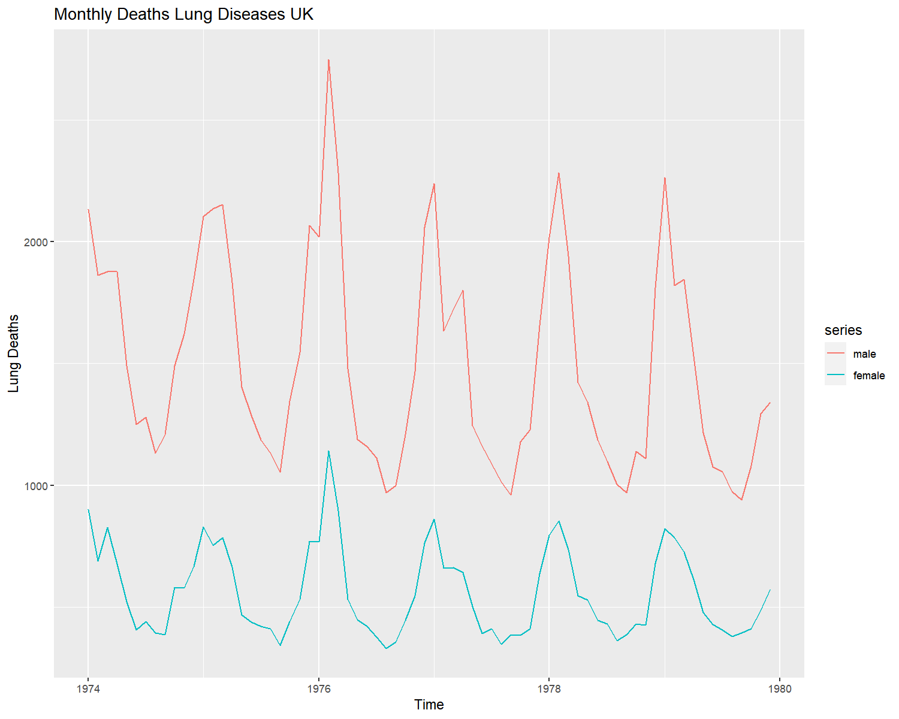
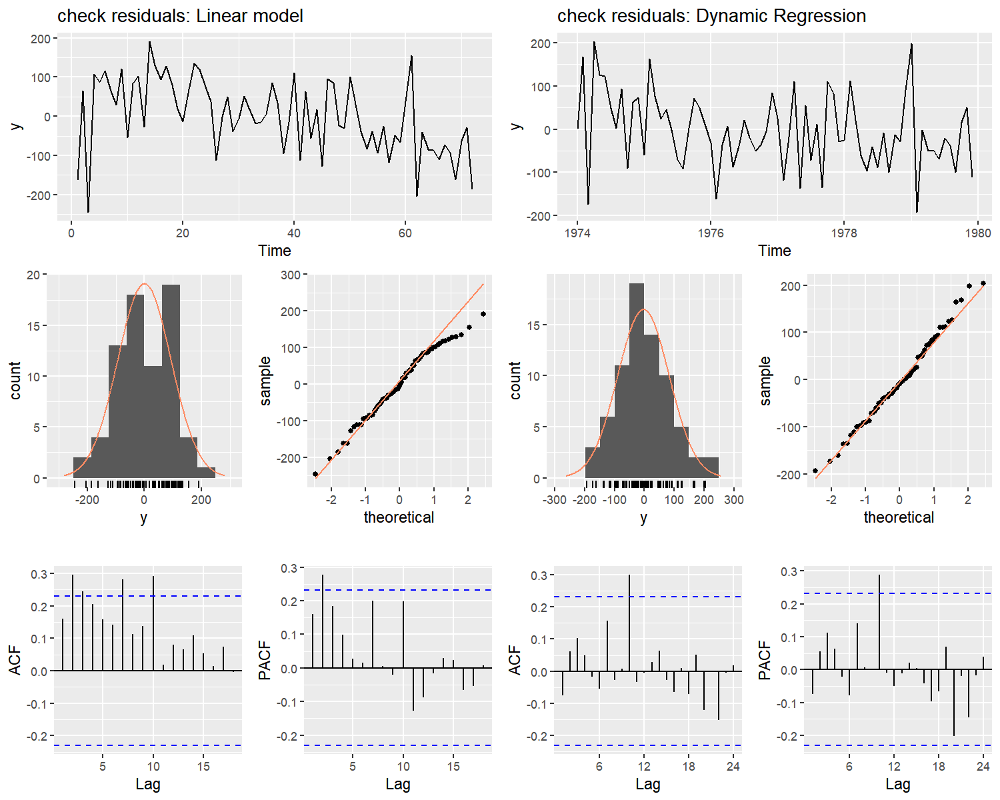

**normality: An R package for normality test in time series**
=============================================================

**normality** is an R package for assess normal distribution, in
numeric, multivariate and time series data, package works as an
extention of
[nortest](https://cran.r-project.org/web/packages/nortest/index.html)
and [MVN](https://cran.r-project.org/web/packages/MVN/index.html)
packages, that checks guassian distribution asumptions on independent
data, and implements
[Epps](https://projecteuclid.org/euclid.aos/1176350618), [Lobatos and
Velsascos](https://www.researchgate.net/publication/23564884),
[Vavras](https://editorialexpress.com/cgi-bin/conference/download.cgi?db_name=res_phd_2012&paper_id=199),
[Nieto-Reyes, Cuestas-Albertos and
Gamboas](https://www.sciencedirect.com/science/article/pii/S0167947314000243?via%3Dihub)
and [Psaradakis and Vavra](http://www.applied-econometrics.com/html)
methodologies for testing normal assumptions in stationary stochastics
proccess.

Additionally, inspired in the function *check.residuals()* of the
[forecast package](https://www.jstatsoft.org/article/view/v027i03), we
provide the **check\_residuals** methods and plots for validating
models’ initial asumptions using the estimated residuals. The function
checks stationarity, homoscedasticity and normality, presenting a report
of the used test and conclusions.

Checking normal distribution
============================

``` r
library(normality)
library(forecast)
#> Warning: package 'forecast' was built under R version 3.6.2
library(ggplot2)
```

To check normal distribution hypotesis in a random sample you can use
the classical hypothesis test such as (*Shapiro-Wilks, Anderson-Darling,
Cramer-von Mises, Lillie, Pearson’s and Shapiro-Francia’*), adapted from
the nortest package. For stationary time series, the Jarque-Bera,
Lobatos-Velascos, Epps and Vavras goodness of fit tests are implemented
as well.

As a simple example, we generate a stationary arma(1,1) model simulated
using an normal distribution, and perfom the Epps test, the initial
hypothesis is that the process follows a normal distribution. The
*normal.test* function, calls the epp.test(), and returns a *htest*
class, in addition it makes a desition using the chosen significance
*alpha*.

``` r
x = arima.sim(100,model = list(ar = 0.32,ma = 0.25))
test1 = normal.test(x,normality = "epps",alpha = 0.05)
test1
#> 
#>  epps test
#> 
#> data:  y
#> epps = 0.4184, df = 2, p-value = 0.1888
#> alternative hypothesis: y is not Gaussian
```

In the next example we generate a stationary ar(2) model, using an
exponetional distribution, and perfom the Lobato and Velascos’ normality
test, In addition we print the test’s conclusion using a significance of
*a**l**p**h**a* = 0.08

``` r
x = arima.sim(200,model = list(ar =c(0.2,0.57)),rand.gen = rexp,rate = 1)

test2 = normal.test(x,normality = "lobato",alpha = 0.08)

test2
test2$Conc

#> 
#>  Lobatos and Velascos test
#> 
#> data:  y
#> lobato = 17.038, df = 2, p-value = 0.0001997
#> alternative hypothesis: y is not Gaussian
#> [1] "Conclusion: y does not have a Gaussian distribution"
```

Checking residuals in time series models
========================================

As an example, we analize the monthly deaths from lung diseases in the
Uk (1974-1979), and try to establish a relationship in the amount of
deaths between male and female. We propose a classic linear model, and a
dynamic regression, in both models we check the fit and parameter
estimation, visualize the model residuals for diagnostic, and finally
normality and stationarity tests.

``` r
lungDeaths = cbind(male = mdeaths,female = fdeaths)
autoplot(lungDeaths) +labs(title = "Monthly Deaths Lung Diseases UK",y = "Lung Deaths")
```



In the linear model, all the estimated parameters are significant,
Adjusted *R*<sup>2</sup> is close to one indicating a good model fit,
and the significance of the F-test validates the model.

``` r
mod1 = lm(male~female,data = lungDeaths)
summary(mod1)
#> 
#> Call:
#> lm(formula = male ~ female, data = lungDeaths)
#> 
#> Residuals:
#>      Min       1Q   Median       3Q      Max 
#> -245.562  -63.749   -3.425   81.607  190.904 
#> 
#> Coefficients:
#>              Estimate Std. Error t value Pr(>|t|)    
#> (Intercept) 176.73002   36.72801   4.812 8.31e-06 ***
#> female        2.35288    0.06242  37.694  < 2e-16 ***
#> ---
#> Signif. codes:  0 '***' 0.001 '**' 0.01 '*' 0.05 '.' 0.1 ' ' 1
#> 
#> Residual standard error: 94.53 on 70 degrees of freedom
#> Multiple R-squared:  0.953,  Adjusted R-squared:  0.9524 
#> F-statistic:  1421 on 1 and 70 DF,  p-value: < 2.2e-16
```

In counterpart, the time series plot reveals some dependency on the
data, and a dynamic regression could offer better results, the estimated
parameters in this new model are significant as well.

``` r
mod2 = Arima(lungDeaths[,1],xreg = lungDeaths[,2],order = c(0,1,1))
summary(mod2)
#> Series: lungDeaths[, 1] 
#> Regression with ARIMA(0,1,1) errors 
#> 
#> Coefficients:
#>           ma1    xreg
#>       -0.8417  2.3121
#> s.e.   0.0677  0.0560
#> 
#> sigma^2 estimated as 7656:  log likelihood=-417.83
#> AIC=841.66   AICc=842.02   BIC=848.45
#> 
#> Training set error measures:
#>                   ME     RMSE      MAE        MPE     MAPE      MASE
#> Training set -3.1393 85.65388 68.00585 -0.6859468 4.666029 0.3909131
#>                     ACF1
#> Training set -0.07512203
```

Now we perfom a visual comparation of the two models, the linear model
residuals, do not seem to have a gaussian distribution (*left qqplot and
histogram*) and the acf plots shows some correlated structure. In
contrast, the histograms and qq-plots of the dynamic regression indicate
that the residuals have a normal distribution, and the acf plots do not
show a strong correlation

``` r
g = plot_compare(model1 = mod1,model2 = mod2,name1 = "Linear model",name2 = "Dynamic Regression")
g
```




The residuals diagnostic show that the dynamic regression adjust better
to the data than a simple linear model. Finally, we check the selected
model asumptions, for it we use the *check\_residual()* method, the
function performs a unit root, seasonal and arch effect tests to check
stationarity, and a normality test to check the gaussian distribution.

If the given model is for time series analysis, the check\_residuals()
function will perfom the *Epps test* for stationary process by default,
in other case it will perfom the *shapiro-wilks test* for random
samples.

``` r
check_residuals(y = mod2,unit_root = "pp",normality = "lobatos")
#> 
#>  *************************************************** 
#> 
#>  Unit root test for stationarity: 
#> 
#>  Phillips-Perron Unit Root Test
#> 
#> data:  y
#> Dickey-Fuller Z(alpha) = -81.767, Truncation lag parameter = 3, p-value
#> = 0.01
#> alternative hypothesis: stationary
#> 
#> 
#>  Conclusion: y is stationary
#>  *************************************************** 
#> 
#>  Unit root test for seasonality: 
#> 
#>  OCSB test
#> 
#> data:  y
#> 
#> Test statistic: -5.8025, 5% critical value: -1.803
#> alternative hypothesis: stationary
#> 
#> Lag order 0 was selected using AIC
#>  Conclusion: y is stationary
#>  
#>  *************************************************** 
#> 
#>  arch test for heteroscedasticity: 
#> 
#>  Box-Ljung test
#> 
#> data:  y^2
#> X-squared = 8.5737, df = 2, p-value = 0.01375
#> alternative hypothesis: y is heteroscedastic
#> 
#> 
#>  Conclusion: y is heteroscedastic
#>  
#>  *************************************************** 
#> 
#>  Goodness of fit test for Gaussian Distribution: 
#> 
#>  epps test
#> 
#> data:  y
#> epps = 0.24362, df = 2, p-value = 0.1147
#> alternative hypothesis: y is not Gaussian
#> 
#> 
#>  Conclusion: y has a normal distribution
#>  
#>  ***************************************************
```

Acepted models for residual check
---------------------------------

Currently our check\_residuals(), check\_plot(), and plot compare
methods are valid for the current models and classes:

-   **ts**: for univariate time series

-   **numeric**: for numeric vectors

-   **arima0**: from the stats package

-   **Arima**: from the forecast package

-   **fGARCH**: from the fGarch package

-   **lm**: from the stats package

-   **glm**: from the stats package

-   **HoltWinters**: from the stats and forecast package

-   **ets**: from the forecast package

-   **forecast methods**: from the forecast package.

For overloading more functions, methods or packages, please made a pull
request or send a mail to: asael\_am@hotmail.com

References
==========

-   Epps, T.W. (1987). Testing that a stationary time series is Gaussian
    “The Annals of Statistic, Vol 15, No 4, 1683-1698”

-   Nieto-Reyes, A., Cuesta-Albertos, J. & Gamboa, F. (2014) “A
    random-projection based test of Gaussianity for stationary
    processes,” Computational Statistics & Data Analysis, Elsevier,
    vol. 75(C), pages 124-141.

-   Lobato, I., & Velasco, C. (2004). A SIMPLE TEST OF NORMALITY FOR
    TIME SERIES. Econometric Theory, 20(4), 671-689.
    <a href="doi:10.1017/S0266466604204030" class="uri">doi:10.1017/S0266466604204030</a>

-   Patrick Royston (1982). An extension of Shapiro and Wilk’s W test
    for normality to large samples. Applied Statistics, 31, 115–124.
    doi: 10.2307/2347973.

-   Hyndman and Khandakar, Automatic Time Series Forecasting: The
    forecast package for R.

-   Dickey DA and Fuller WA (1979), "Distribution of the Estimators for Autoregressive Time Series with a Unit Root", :427-431.
