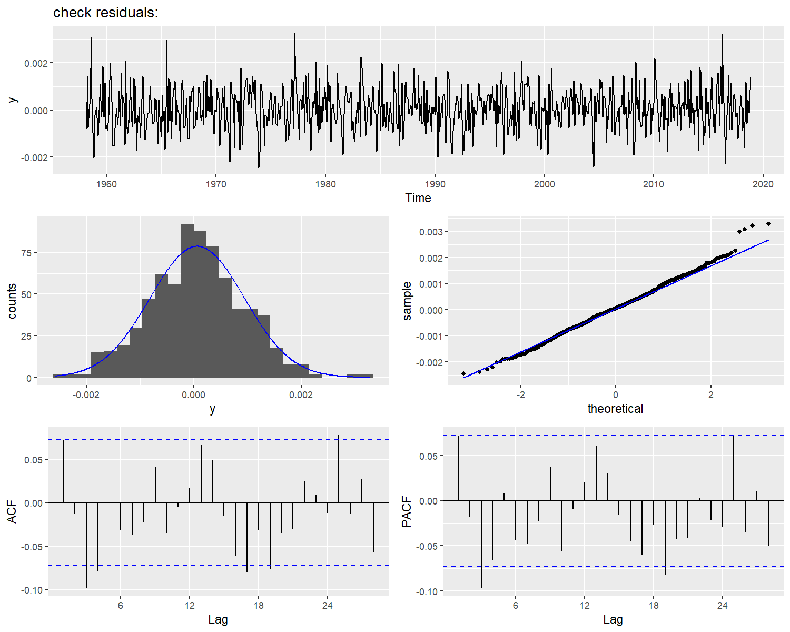

**nortsTest: An R Package for Assessing Normality of Stationary Process**
======================================================================

**nortsTest** is an R package for assessing normality of stationary
process, it tests if a given data follows a stationary Gaussian process.
The package works as an extension of the **nortest** package that performs 
normality tests in random samples (*independent data*). The four principal 
package’s functions are:

-   epps.test() function that implements the [Epps test](https://projecteuclid.org/euclid.aos/1176350618),

-   lobato.test() function that implements the Lobato and Velasco’s test,

-   vavra.test() function that implements the [Psaradaki and Vavra’s test](http://www.applied-econometrics.com),

-   rp.test() function that implements the random projections test of
    Nieto-Reyes, Cuesta-Albertos and Gamboa’s test.

Additionally, inspired in the function *check.residuals()* of the
[forecast package](https://github.com/robjhyndman/forecast), we
provide the **check\_residuals** methods for checking model’s
assumptions using the estimated residuals. The function checks
stationarity, homoscedasticity and normality, presenting a report of the
used tests and conclusions.

Checking normality assumptions
------------------------------

``` r
library(nortsTest)
```

Classic hypothesis tests for normality such as *Shapiro & Wilk, Anderson
& Darling*, or *Jarque & Bera*, do not perform well on dependent data.
Therefore, these tests should not be used to check whether a given time
series has been drawn from a Gaussian process. As a simple example, we
generate a stationary ARMA(1,1) process simulated using an t student
distribution with 7 degrees of freedom, and perform the Anderson-Darling
test from the *nortest package*.

``` r
x = arima.sim(100,model = list(ar = 0.32,ma = 0.25),rand.gen = rt,df = 7)

nortest::ad.test(x)
#> 
#>  Anderson-Darling normality test
#> 
#> data:  x
#> A = 0.50769, p-value = 0.1954
```

The null hypothesis is that the data has a normal distribution and
therefore, follows a Gaussian Process. At *α* = 0.05 significance level
the alternative hypothesis is rejected and wrongly concludes the data
follows a Gaussian process. Applying the Lobato and Velasco’s test of
our package, the null hypothesis is correctly rejected.

``` r
lobato.test(x)
#> 
#>  Lobatos and Velascos test
#> 
#> data:  x
#> lobato = 16.864, df = 2, p-value = 0.0002177
#> alternative hypothesis: x does not follow a Gaussian Process
```

Example: stationary AR(2) process
---------------------------------

In the next example we generate a stationary AR(2) process, using an
exponential distribution with rate of 5, and perform the *epps* and *rp*
with k = 5 random projections tests. With a significance level at
*a**l**p**h**a* = 0.05, the null hypothesis of non-normality is
rejected.

``` r
set.seed(298)
# Simulating the AR(2) process
x = arima.sim(250,model = list(ar =c(0.2,0.3)),rand.gen = rexp,rate = 5)

# tests
epps.test(x)
#> 
#>  epps test
#> 
#> data:  x
#> epps = 38.158, df = 2, p-value = 5.178e-09
#> alternative hypothesis: x does not follow a Gaussian Process
rp.test(x,k = 5)
#> 
#>  k random projections test
#> 
#> data:  x
#> k = 5, lobato = 188.771, epps = 28.385, p-value = 0.0007823
#> alternative hypothesis: x does not follow a Gaussian Process
```

Checking model’s assumptions: cardox data
-----------------------------------------

As an example, we analyze the monthly mean carbon dioxide (*in ppm*)
from the **astsa package**, measured at Mauna Loa Observatory, Hawaii.
from March, 1958 to November 2018. The carbon dioxide data measured as 
the mole fraction in dry air, on Mauna Loa constitute the longest record 
of direct measurements of CO2 in the atmosphere. They were started by C. 
David Keeling of the Scripps Institution of Oceanography in March of 1958 
at a facility of the National Oceanic and Atmospheric Administration.

``` r
library(astsa)
data("cardox")

autoplot(cardox,xlab = "years",ylab = " CO2 (ppm)",color = "darkred",
size = 1,main = "Carbon Dioxide Levels at Mauna Loa")
```


The time series clearly has trend and seasonal components, for analyzing
the *cardox* data we proposed a Gaussian linear state space model. We
use the model’s implementation from the [forecast package](https://github.com/robjhyndman/forecast) as follows:

``` r
library(forecast)
#> 
#> Attaching package: 'forecast'
#> The following object is masked from 'package:astsa':
#> 
#>     gas

model = ets(cardox)
summary(model)
#> ETS(M,A,A) 
#> 
#> Call:
#>  ets(y = cardox) 
#> 
#>   Smoothing parameters:
#>     alpha = 0.5591 
#>     beta  = 0.0072 
#>     gamma = 0.1061 
#> 
#>   Initial states:
#>     l = 314.6899 
#>     b = 0.0696 
#>     s = 0.6611 0.0168 -0.8536 -1.9095 -3.0088 -2.7503
#>            -1.2155 0.6944 2.1365 2.7225 2.3051 1.2012
#> 
#>   sigma:  9e-04
#> 
#>      AIC     AICc      BIC 
#> 3136.280 3137.140 3214.338 
#> 
#> Training set error measures:
#>                     ME     RMSE       MAE         MPE       MAPE      MASE
#> Training set 0.0232403 0.312003 0.2430829 0.006308831 0.06883992 0.1559102
#>                    ACF1
#> Training set 0.07275949
```

The best fitted model is a *multiplicative level, additive trend and
seasonality* state space model. If the model’s assumptions are
satisfied, then the model’s errors behave like a Gaussian stationary
process. These assumptions can be checked using our *check\_residuals*
functions.

In this case, we use an Augmented Dickey-Fuller test for stationary
assumption, and a random projections test for normality.

``` r
check_residuals(model,unit_root = "adf",normality = "rp",plot = TRUE)
#> 
#>  *************************************************** 
#> 
#>  Unit root test for stationarity: 
#> 
#>  Augmented Dickey-Fuller Test
#> 
#> data:  y
#> Dickey-Fuller = -9.7249, Lag order = 8, p-value = 0.01
#> alternative hypothesis: stationary
#> 
#> 
#>  Conclusion: y is stationary
#>  *************************************************** 
#> 
#>  Goodness of fit test for Gaussian Distribution: 
#> 
#>  k random projections test
#> 
#> data:  y
#> k = 2, lobato = 3.8260, epps = 1.3156, p-value = 0.3328
#> alternative hypothesis: y does not follow a Gaussian Process
#> 
#> 
#>  Conclusion: y follows a Gaussian Process
#>  
#>  ***************************************************
```



Now that all the model’s assumptions are checked, the model is accepted
and can be used to forecast.

``` r
autoplot(forecast(model,h = 12),include = 100,xlab = "years",ylab = " CO2 (ppm)",
         main = "Forecast: Carbon Dioxide Levels at Mauna Loa")
```


How to install nortsTest?
-------------------------

The current development version can be downloaded from GitHub via

``` r
if (!requireNamespace("remotes")) install.packages("remotes")

remotes::install_github("asael697/nortsTest",dependencies = TRUE)
```

Additional test functions
-------------------------

The **nortsTest** package offers additional functions for descriptive
analysis in univariate time series.

-   *uroot.test*: performs unit root test for checking stationary in
    linear time series. The Ljung-Box, Augmented Dickey-Fuller,
    Phillips-Perron and Kpps tests can be selected with the *unit\_root*
    option parameter.

-   *seasonal.test*: performs seasonal unit root test for stationary in
    seasonal time series. The hegy, ch and ocsb tests are available with
    the seasonal option parameter.

-   *arch.test*: for checking the ARCH effect in time series. The
    Ljung-Box and Lagrange Multiplier tests can be selected from the
    *arch* option parameter.

-   *normal.test*: for normal distribution check in time series and
    random samples. The tests presented above can be chosen for
    stationary time series. For random samples (*independent data*), the
    Anderson & Darling, Shapiro & Wilks, and Jarque-Bera tests are
    available with the normality option parameter.

For visual diagnostic, we offer ggplot2 methods for numeric and
time-series data. Most of the functions were adapted from Rob Hyndman’s
[forecast package](https://github.com/robjhyndman/forecast).

-   *autoplot*: For plotting time series objects (*ts class*).

-   *gghist*: histograms for numeric and univariate time series.

-   *ggnorm*: quantile-quantile plot for numeric and univariate time
    series.

-   *ggacf & ggpacf*: partial and auto correlation functions plots for
    numeric and univariate time series.

-   *check\_plot*: summary diagnostic plot for univariate starionary
    time series.

Accepted models for residual check
----------------------------------

Currently our check\_residuals() and check\_plot() methods are valid for
the current models and classes:

-   **ts**: for uni variate time series

-   **numeric**: for numeric vectors

-   **arima0**: from the stats package

-   **Arima**: from the forecast package

-   **fGARCH**: from the fGarch package

-   **lm**: from the stats package

-   **glm**: from the stats package

-   **Holt and Winters**: from the stats and forecast package

-   **ets**: from the forecast package

-   **forecast methods**: from the forecast package.

For overloading more functions, methods or packages, please make a pull
request or send a mail to: asael\_am@hotmail.com

References
----------

-   Epps, T.W. (1987). Testing that a stationary time series is
    Gaussian. *The Annals of Statistic*. 15(4), 1683-1698.

-   Nieto-Reyes, A., Cuesta-Albertos, J. & Gamboa, F. (2014). A
    random-projection based test of Gaussianity for stationary
    processes. *Computational Statistics & Data Analysis, Elsevier*.
    75(C), 124-141.

-   Lobato, I., & Velasco, C. (2004). A simple test of normality for
    time series. *Journal Econometric Theory*. 20(4), 671-689.

-   Psaradakis, Z. & Vavra, M. (2017). A distance test of normality for
    a wide class of stationary process. *Journal of Econometrics and
    Statistics*. 2, 50-60.

-   Hyndman, R. & Khandakar, Y. (2008). Automatic time series
    forecasting: the forecast package for R. *Journal of Statistical
    Software*. 26(3), 1-22.
